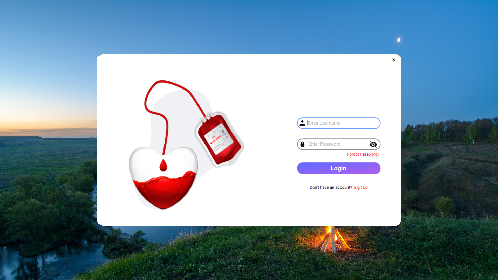
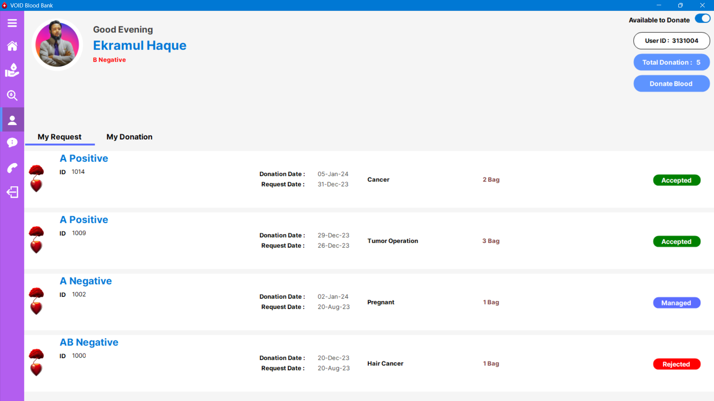
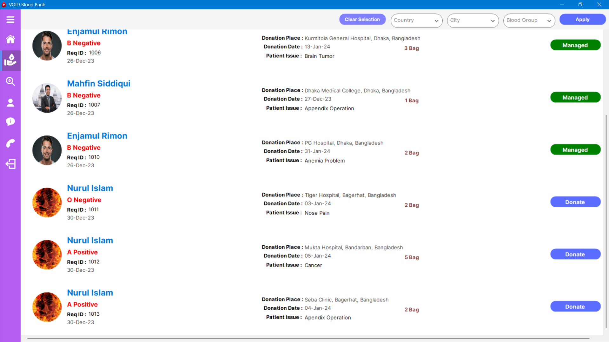
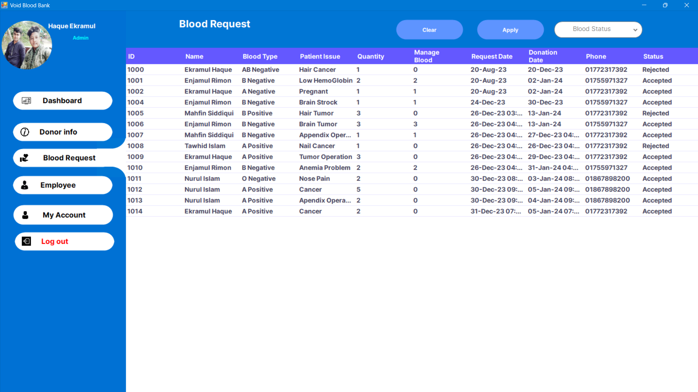
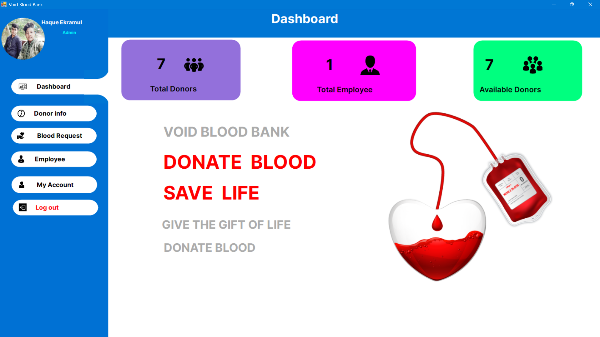
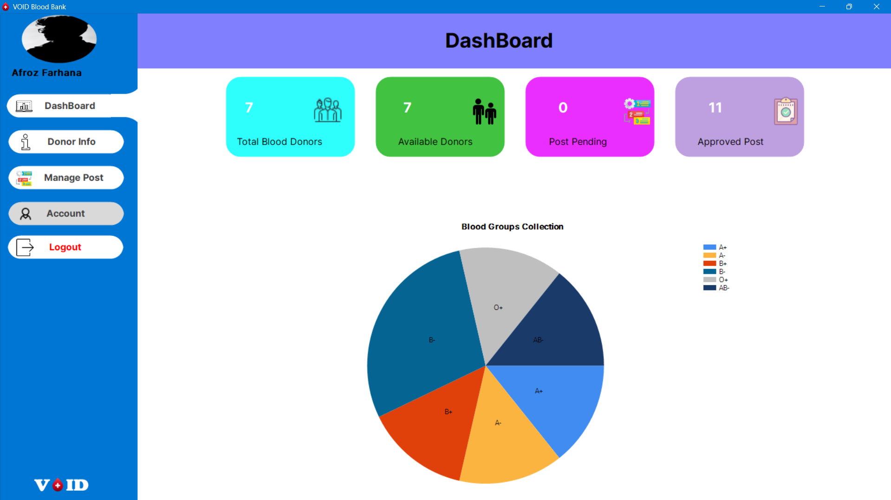
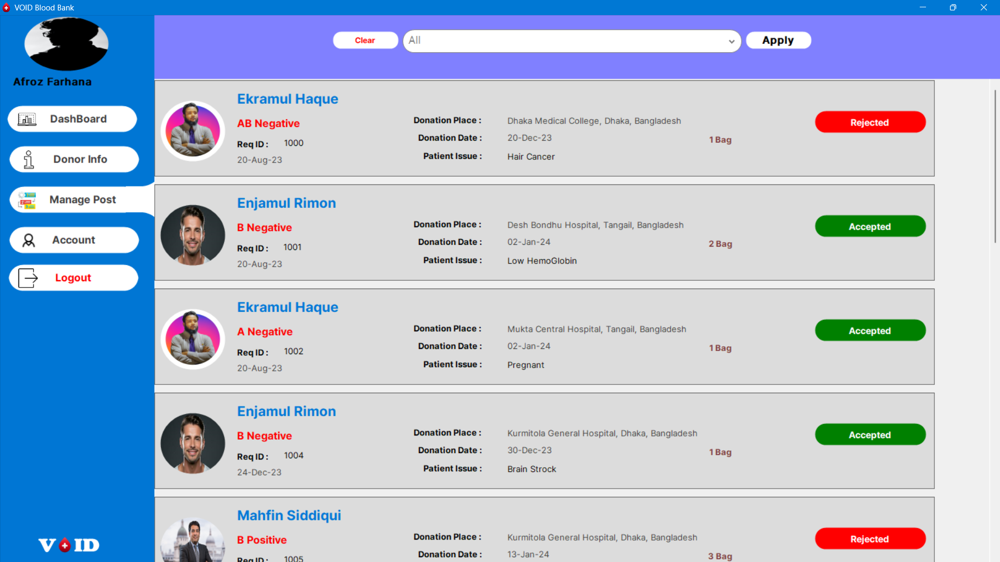
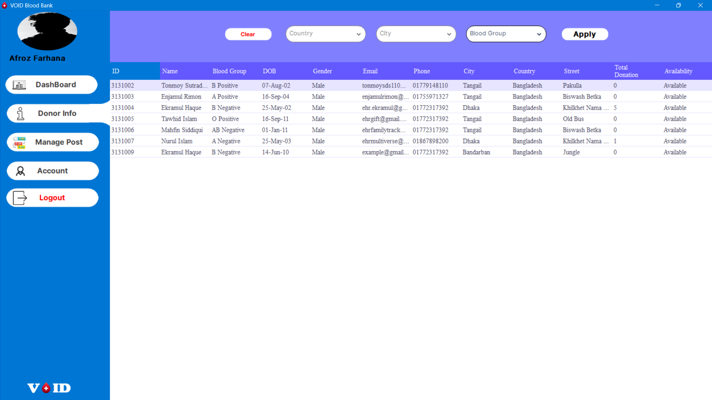

# Blood Donation Management System

A comprehensive .NET-based platform developed to streamline blood donation processes. The application enables users to request blood, employees to approve/reject requests, and donors to view and fulfill requests. It includes a robust search system for donors and blood requests, with admin functionalities to manage employees and users.

## Screenshots

- User Panel
   

- Admin Panel
  

- Employee Panel
   

---

## Features

- Windows Form Application
- User roles: **Admin**, **Employee**, **Donor**, and **Requester**
- Blood request approval/rejection
- Donor availability statistics
- Search donors and blood requests
- Employee and user management
- Attractive UI with **GunaUI 2**, **Krypton**, and **Metro Framework**
- **RDBMS** with normalization and ER diagrams

---

## 🛠️ Technologies Used

---

## 🤝 Contributions

Feel free to fork, enhance the features, and submit pull requests. Contributions are encouraged!

---

## 📫 Contact

**Ekramul Haque**  
- 📧 Email: [ehr.ekramul@gmail.com](mailto:ehr.ekramul@gmail.com)

---

## 🌐 Connect with Me

---

## ⭐ Star This Repo!

If you find this repository helpful, show your support by giving it a ⭐! 😊

---

## 📜 License

Licensed under the **MIT License**. Feel free to use and modify the code.

---

# **🎉 Happy Coding! 🎉**

